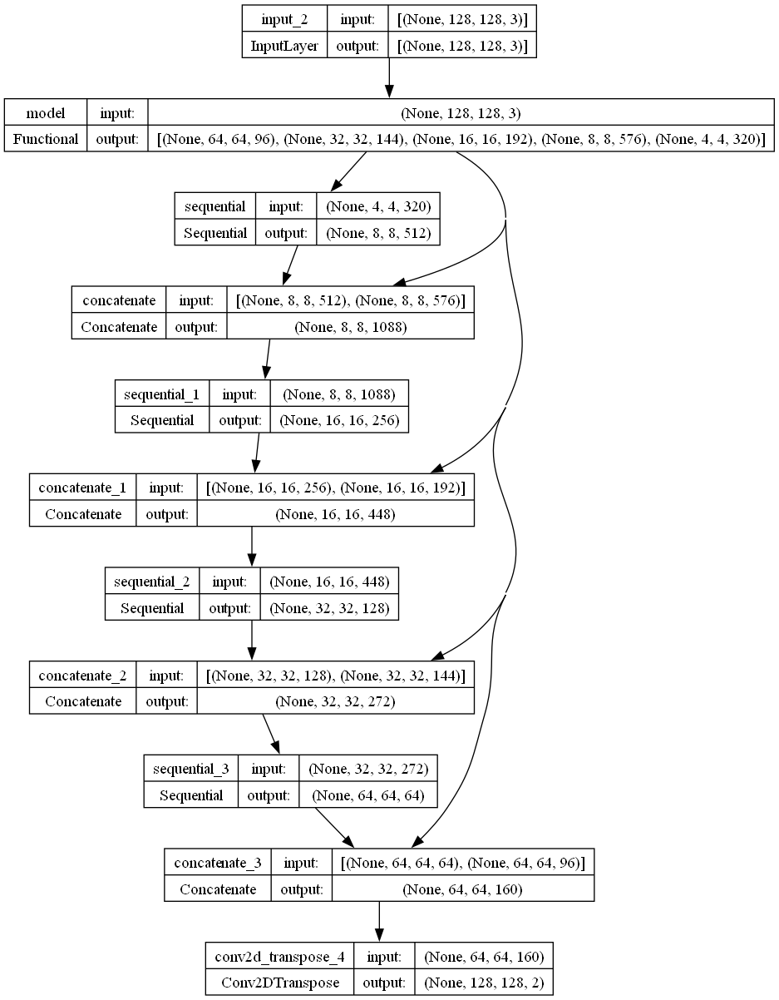

# Cell Nuclei Detection via U-Net Semantic Segmentation

This project is dedicated to creating an AI-powered model to automate the detection of cell nuclei in biomedical imagery. The precise identification of cell nuclei is pivotal in biological research, as it allows scientists to analyze the DNA within these structures, which is fundamental to understanding cellular functions. This model's ability to pinpoint cell nuclei will aid in assessing cellular responses to various treatments and unraveling complex biological mechanisms.

We're developing a deep learning-based semantic segmentation model capable of automatically recognizing nuclei in biomedical images. This model will undergo training with a vast collection of biomedical images, and its performance will be gauged on its precision and speed in detecting cell nuclei.

# Acknowledgments

Our heartfelt thanks go to Kaggle and the Data Science Bowl community for providing the dataset essential for this project. Access the dataset here: [Kaggle Dataset](https://www.kaggle.com/competitions/data-science-bowl-2018/data).

# Project Overview

The code structure encompasses various segments, including data loading, preprocessing, and model training, detailed as follows:

## 1. Data Loading

Initially, the code fetches data from the file system utilizing OpenCV. It processes images and their corresponding masks, which are resized to 128 x 128 pixels and formatted into RGB for images and grayscale for masks. Subsequently, these are transformed into NumPy arrays and exemplified using Matplotlib.

*Sample Images vs Masks From Training Dataset*

## 2. Data Preprocessing

Here, mask images gain an additional dimension and are converted into binary class labels. The input images undergo normalization within a 0 to 1 range. The dataset splits into training and test sets via Scikit-learn's train_test_split() function, forming TensorFlow datasets. These datasets then merge to create tuples of images and their corresponding masks.

## 3. Visualizing Examples

A display function is crafted to exhibit a trio of images: the input, the true mask, and the predicted mask, side by side. The training batches are iterated to showcase various training set examples.

## Data Augmentation

Data augmentation techniques, including elastic transformations (mimicking water-like deformations), affine adjustments, and contrast enhancements, are employed. In the final training stage, 50% of the data is augmented to enrich the model's learning process.

*Data Augmentation Example*

## 4. Model Development

Our model, U-Net, is a complex structure with 6.5 million parameters, accepting an input tensor shaped [128, 128, 3]. It integrates MobileNetV2 layers for feature extraction and convolutional layers for upsampling, connected via skip connections. The output is crafted through a Conv2DTranspose layer, matching the input's size.

*U-Net Model Architecture*

*U-Net Model Summary*

## 5. Model Training and Predictions

This segment demonstrates the model's predictions, comparing results before and after training. The model's proficiency in semantic segmentation becomes evident after 100 epochs.

*Predicted Mask Before Training*

*Predicted Mask After 100 Epochs*

## Conclusion

Through this code, we've showcased the implementation of image segmentation using TensorFlow's U-Net model. This framework not only facilitates data loading and preprocessing but also guides through defining and training the model. This serves as a foundation for further exploration and optimization with various datasets and architectural tweaks. For inspiration, refer to [this repository](https://github.com/M-ImranIsmael/Nuclei-Image-Segmentation/tree/master).