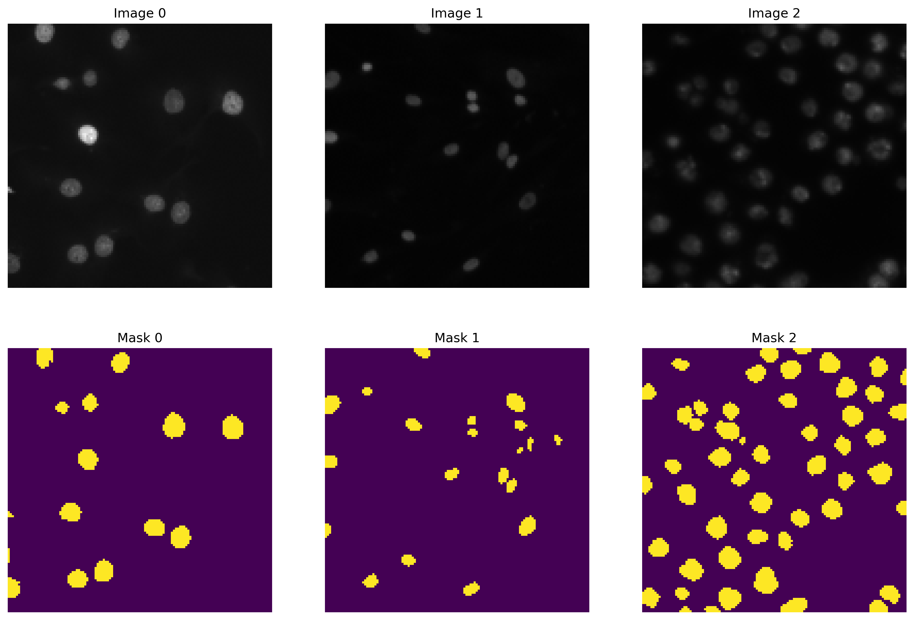
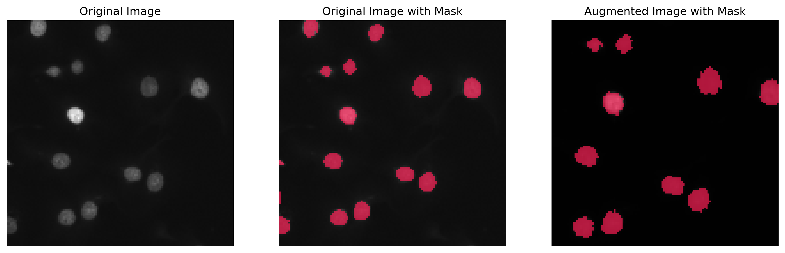
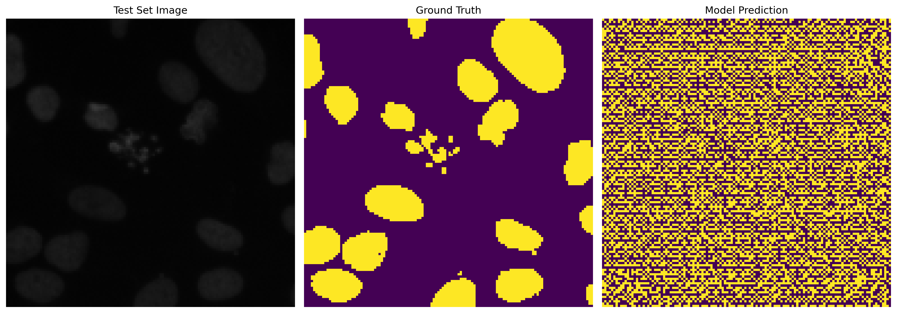
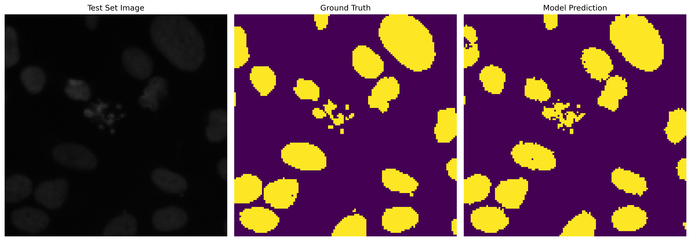

# Cell Nuclei Identification through U-Net

Our project's objective is to create an AI-driven semantic segmentation model that can accurately and efficiently identify cell nuclei in biomedical images. This is a significant step in biological research, as it allows for detailed analysis of DNA within cell nuclei, contributing to our understanding of cellular functions and responses to various treatments.

The model, leveraging advanced deep learning techniques, will be trained on a comprehensive dataset of biomedical images. Its performance will be rigorously evaluated, focusing on its precision and speed in detecting cell nuclei.

## Data Loading

The initial code segment utilizes OpenCV to load data from the file system. We handle images and their corresponding masks separately, storing them in two distinct lists. These images are resized to 128 x 128 pixels, converted to RGB format, whereas the masks are resized similarly and converted to grayscale. The processed images and masks are then transformed into NumPy arrays. A visual representation of the sample images and masks is displayed using Matplotlib.

  
   
  <em>Sample Images vs Masks From Train Dataset</em>

## Data Preprocessing and Augmentation

This stage involves expanding the mask images to add an extra dimension and converting them into binary class labels. The input images undergo normalization to fit within a 0 to 1 range. The dataset is split into training and test sets using Scikit-learn's train_test_split() function. The numpy arrays are then converted into TensorFlow datasets and combined using the zip() method to form tuples of images and their corresponding masks.

To enhance the robustness of our model, we incorporated data augmentation techniques like elastic transformation (mimicking water-like deformations), affine transformations, and contrast adjustments. In the final training phase, we utilized a dataset enriched with 50% augmented data.

  
   
  <em>Data Augmentation</em>

## 4. Constructing the Image Segmentation Model

The U-Net model, consisting of 6.5 million parameters, accepts an input tensor shaped [128, 128, 3]. It incorporates MobileNetV2 layers for feature extraction and multiple convolutional layers for upsampling, connected by skip connections. The final output is generated by a Conv2DTranspose layer, resulting in an output tensor mirroring the input size, segmented into output_channels classes. The model is sequentially structured, with layers named according to their functionality. A summary details each layer's output shape and parameter count.

  <a href="images/model_summary.txt" download="model_summary.txt">Download Model Summary</a>
     
  <em>U-Net model Summary</em>

## 5. Training the Model and Analyzing Predictions

This section is dedicated to model training and evaluating its predictive capabilities. We showcase the model's learning progress by comparing the predicted masks before and after training. The difference is evident after 100 epochs, highlighting the model's effectiveness in learning semantic segmentation.

  
   
  <em>Predicted Mask Before Training</em>

  
   
  <em>Predicted Mask After 100 Epochs</em>

## Conclusion

This project successfully demonstrates the implementation of image segmentation using the U-Net model in TensorFlow. It comprehensively covers data loading, preprocessing, model architecture definition, and training. This code serves as a foundation for further exploration and optimization in various datasets, model architectures, and hyperparameters, aiming to enhance model accuracy.

# Acknowledgments

Special thanks are extended to Kaggle and the Data Science Bowl community for their invaluable contribution of the dataset pivotal to our project, accessible at [Kaggle Data Science Bowl 2018 Dataset](https://www.kaggle.com/competitions/data-science-bowl-2018/data). The project was inspired by [Nuclei Image Segmentation GitHub Repository](https://github.com/M-ImranIsmael/Nuclei-Image-Segmentation)
